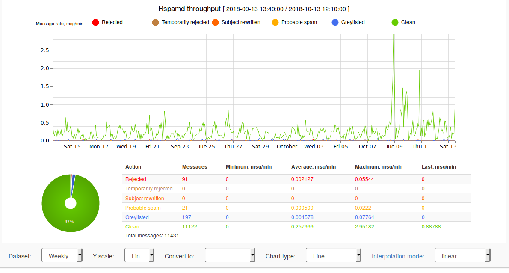

## Default configuration

By default, the mail server is protected against spam with [rspamd](https://www.rspamd.com/).

```yml
mail:
  […]
  antispam:                 # Check inbound and outbound emails for viruses
    active: true            # use false to disable
```

Optionally, the web user interface is accessible from the local network:

```yml
mail:
  [...]
  antispam:                 # Check inbound and outbound emails for viruses
    webui:                  # rspamd web interface
      active: true          # Activate or not
      allow:                # a list of IP address that can access the web interface
        - 192.168.0.0/16    # RFC1918 local networks
        - 172.16.0.0/12
        - 10.0.0.0/8
```

A strong password is generated for the administrator account. After the deployment, the password is stored in the
credentials store, using `rspamd/admin`.
