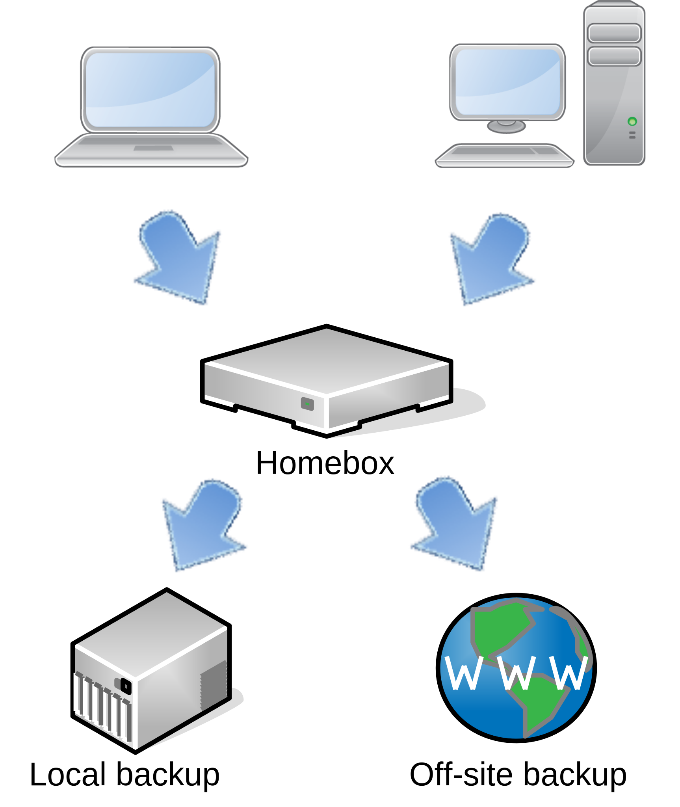
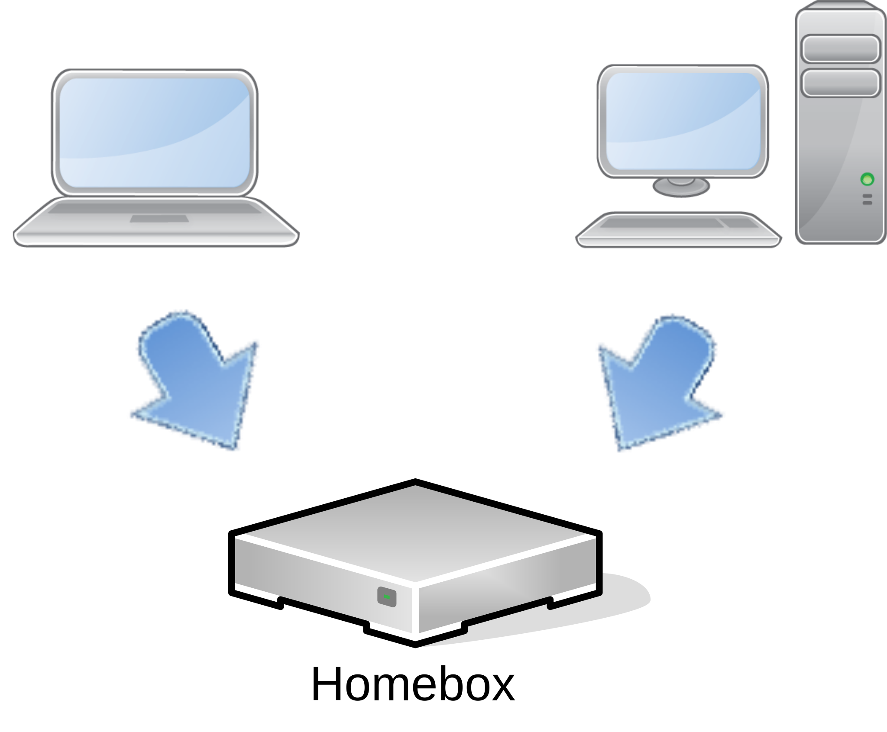

# Backup server

The homebox platform can be configured to act as a backup server for your home network, using
[borg-backup](https://www.borgbackup.org/) software.

## Hardware configuration

### Ideal configuration


This configuration allows you to use encryption and incremental backups, with a plain basic local or remote storage,
like a USB RAID enclosure or a remote samba share.

It will automatically use the first backup location you have defined. For instance, if you have configured hombox to
backup on local USB drive and on a remote SAMBA share, the local drive will be used for storage:

### Local backup only



If you do not have an external device to store the backup, you can still use homebox as a backup server. In this case,
the files will be stored in the home folder, for each user, using the same principle.

This is obviously less safe than using a remote or external device to backup. You can mitigate the risk by using
[software RAID](preseed.md#software-raid) in the preseed file.

## Tutorial

In this example, you will see how to set up a backup solution on a USB NAS attached to your homebox.

Your backup configuration should look like this:

```yaml
# Install backup scripts
backup:
  install: true
  type: borgbackup
  alerts:
    jabber: true
  locations:
  - name: nas1
    automount: true
    url: usb://mnt/backup/nas1/homebox
    uuid: c09c23de-97b6-492b-9c7f-e3cd894862d1
    active: yes
    frequency: daily
    keep_daily: 7
    keep_monthly: 12
    idle_sec: 60
```

In this example, each user will have a dedicated directory accessible over SSH, on the USB drive ‘nas1’. Under the hood,
this is done in the SSH authorized_keys configuration file on the server.

This is an example on how to back-up a folder in your home directory. You need to have borg-backup installed on your
workstations, and to have created an SSH key, dedicated for backup.

### Step 1: Configure the SSH connection

Example of the syntax to use in your `~/.ssh/config` configuration file:

```txt
Host backup.homebox.space
  User bob
  IdentityFile ~/.ssh/backup.rsa
```

### Step 2: Initialise the backup on your local machine

First, you need to initialise a backup repository on your machine:

```sh

Enter new passphrase:
Enter same passphrase again:
Do you want your passphrase to be displayed for verification? [yN]:

By default repositories initialized with this version will produce security
errors if written to with an older version (up to and including Borg 1.0.8).

If you want to use these older versions, you can disable the check by running:
borg upgrade --disable-tam ssh://bob@backup.homebox.space/mnt/backup/local/bob/books

See https://borgbackup.readthedocs.io/en/stable/changes.html#pre-1-0-9-manifest-spoofing-vulnerability for details about the security implications.

IMPORTANT: you will need both KEY AND PASSPHRASE to access this repo!
Use "borg key export" to export the key, optionally in printable format.
Write down the passphrase. Store both at safe place(s).

```

### Step 3: create the first backup

Then, create the backup itself:

```sh
bob@workstation:~ $ borg create --progress bob@backup.homebox.space:/mnt/backup/nas1/bob/Documents::Documents Documents
Enter passphrase for key /home/bob/.config/borg/keys/backup_homebox_space__mnt_backup_nas1_bob_backups:
```
