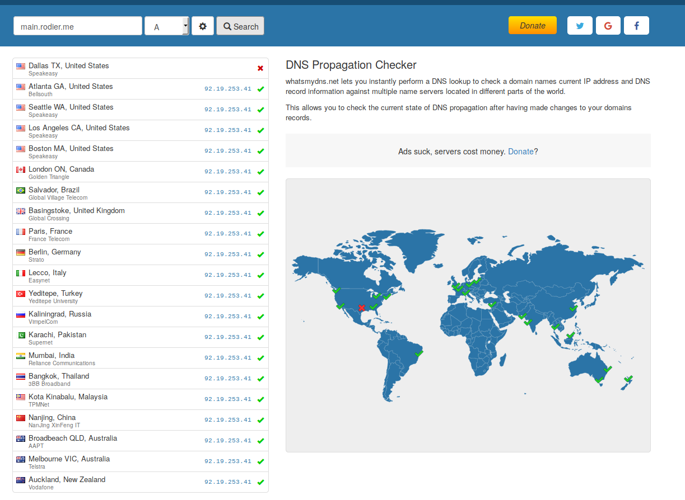

## DNS propagation

Whichever DNS server you are going to use, you will need to wait for
the entries to be "propagated" over internet.

This is an absolute requirement for LetsEncrypt certificates, so they
can connect to your server for the SSL challenge / response authentication.

You will have to proceed in two steps:

1. Create your DNS entries in the administration interface.
2. Wait for the DNS information to be propagated on internet.

For the first step, it is advised to create a main and a wildcard A
records, that points to your IP address.

Example of records to create, with your IP address being 123.45.67.89:

| Record name     | Type  |     Value                       | TTL|
|-----------------|-------|---------------------------------|----|
| *               | A     |                    123.45.67.89 | 2h |
| @               | A     |                    123.45.67.89 | 2h |
| main            | A     |                    123.45.67.89 | 1h |
| autoconfig      | CNAME |                            main | 1h |
| autodiscover    | CNAME |                            main | 1h |
| imap            | CNAME |                            main | 1h |
| ldap            | CNAME |                            main | 1h |
| pop3            | CNAME |                            main | 1h |
| smtp            | CNAME |                            main | 1h |
| webmail         | CNAME |                            main | 1h |
| www             | CNAME |                            main | 3h |
| @               | MX    |                        main (5) | 1h |
| @               | TXT   | "v=spf1 mx ip4 … ecc:6d56 ~all" | 1h |
| main._domainkey | TXT   | "v=DKIM1; n=\" … Z1KkCAwEAAQ==" | 1h |
| _dmarc          | TXT   | "v=DMARC1; p=q … frf; ri=86400" | 1h |


For the second step, this can be monitored and checked on one of these sites:
[www.whatsmydns.net](https://www.whatsmydns.net/):



Or [dnschecker.org](https://dnschecker.org).

Or from the command line:

_DNS not updated:_

```sh
root@homebox /etc/network# host main.hmbx.pw 1.1.1.1
Using domain server:
Name: 1.1.1.1
Address: 1.1.1.1#53
Aliases:

Host main.hmbx.pw not found: 2(SERVFAIL)
```

_DNS updated:_

```sh
root@homebox /etc/network# host main.rodier.me 1.1.1.1
Using domain server:
Name: 1.1.1.1
Address: 1.1.1.1#53
Aliases:

main.rodier.me has address 92.19.253.41
```

**It is only once the DNS propagation will be complate that you will be
able to run your Ansible deployment scripts.**

## Notes about using bind

You are welcome to use your own DNS server, as _Homebox_ comes with
bind support included. Bind can be configured with or without DNSSEC support.

Even in this case, the DNS propagation mentioned above is still valid.

1. Configure your registrar to use your IP address as a DNS server.
2. Wait for the DNS information to be propagated on internet.

**Note: Complete DNS Resolution may take upto 48 hours.**

The next step is to install your Linux server.
