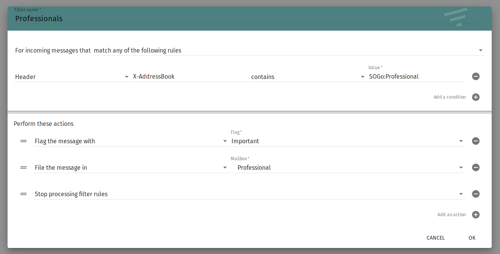

# Presentation

SOGo is a fully supported and trusted groupware server with a focus on scalability and open standards.

SOGo provides a rich AJAX-based Web interface and supports multiple native clients through the use of standard protocols
such as CalDAV, CardDAV and GroupDAV, as well as Microsoft ActiveSync.

SOGo offers multiple ways to access calendaring and messaging data. Your users can either use a web browser, Microsoft
Outlook, Mozilla Thunderbird, Apple iCal, or a mobile device to access the same information.

# Default settings

These settings are loaded by default when installing SOGo:

```yaml
sogo:
  appointment_send_emails: true
  vacation: true
  forward: true
  sieve_scripts: true
  first_day_of_week: 1 # 1 is Monday
  day_start_time: 9
  day_end_time: 17
  time_format: '%H:%M'
  refresh_view_check: every_minute
  auxiliary_accounts: false
  language: English
  enable_public_access: false
  password_change: true
  auxiliary_accounts: true
  milters:
    active: false
    debug: true
```

| Flag                          | Role                                                                                               |
|-------------------------------|----------------------------------------------------------------------------------------------------|
| appointment_send_emails       | Send emails when appointments are created.                                                         |
| vacation                      | Activate vacation functionality in the web interface.                                              |
| forward                       | Activate automatic forward functionality in the web interface.                                     |
| sieve_scripts                 | Allow you to filter your emails using advanced server side filters.                                |
| first_day_of_week             | Set the first day of the week in the interface. Default is Monday, 1. Set it to 0 for Sunday.      |
| day_start_time / day_end_time | The working hours, in 24h notation.                                                                |
| time_format                   | The format used to display the time. See the [strftime](http://strftime.org/) function for format. |
| refresh_view_check            | The time interval to check for new emails.                                                         |
| auxiliary_accounts            | Allow you to retrieve emails from external accounts, directly from the web interface.              |
| language                      | The default language of the web interface¹                                                         |
| enable_public_access          | Allow public access to your calendars and address books, using a specific URL.                     |
| password_change               | Allow you to change your passwords from the web interface.                                         |

!!! Tip
    Possible values are defined in the
    [SOGo installation guide](https://sogo.nu/files/docs/SOGoInstallationGuide.html#_general_preferences)

# Milters

Some advanced features can be deployed along SOGo.

For now, there is one mail filter compatible with SOGo, that searches the addresses in the email received in your address
books, and "tags" the messages accordingly. Coupled with Sieve filters, this allows you to set specific rules for
contacts in your address books. For instance, one auto-responder for personal contacts, and one for professional ones.



When the email address from a received email is found in one or more of your address books, a new header is added to the email:

``` txt hl_lines="8"
Authentication-Results: main.hmbx.pw;
    dkim=pass header.d=rodier.me;
    dmarc=pass (policy=quarantine) header.from=rodier.me;
    spf=pass smtp.mailfrom=postmaster@rodier.me
X-Spam-Status: No, score=0.01
X-AV-Checked: ClamSMTP
X-AddressBook: SOGo:Personal Address Book,SOGo:Professional
```

!!! Warning
    This feature is in testing phase and not activated by default; Any feedback is welcome.

# Compatible clients

SOGo provides calendar and address books synchronisation with multiple devices. You can use any client compatible with
these standards, on many platforms:

## On Linux

- [Evolution](https://wiki.gnome.org/Apps/Evolution/)
- [Thunderbird](https://www.thunderbird.net/)

## On Windows

- [Thunderbird](https://www.thunderbird.net/)
- [eM Client](https://www.emclient.com/) (Not open source)
- Microsoft Outlook (Not open source)

## On Android

- [DavDroid](https://www.davdroid.com/)
- [CalDAV Sync](https://play.google.com/store/apps/details?id=org.dmfs.caldav.lib)
- [CardDAV sync](https://play.google.com/store/apps/details?id=org.dmfs.carddav.sync)
- [OpenTasks](https://play.google.com/store/apps/details?id=org.dmfs.tasks)

## On MacOS / iOS

- Apple Calendar
- Contacts.app
- [Thunderbird](https://www.thunderbird.net/)
- [eM Client](https://www.emclient.com/)
