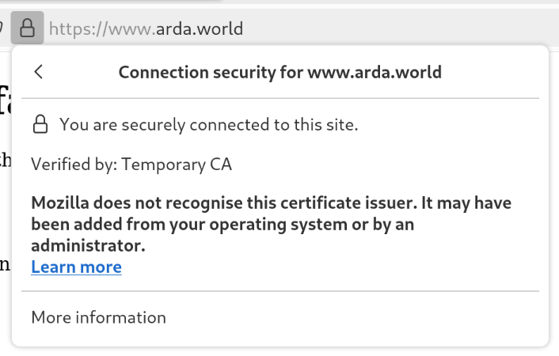

# Local network setup

This step is not absolutely required, but it is sometimes convenient to test the system
with real applications, for instance desktop email clients.

Once finished, you will be able to test email access, browse the site, test the Jabber
server, etc, from your workstation. It has only be tested on Debian Linux, but this can be
adapted easily.

## DNS delegation

Any other caching DNS server may work, but unbound has the advantage of being very
modular. With just one configuration file, you will be able to transparently query the
temporary DNS server on the virtual machine.

Create this configuration file in `/etc/unbound/unbound.conf.d/network.conf`:

```sh
sudo vi /etc/unbound/unbound.conf.d/network.conf
```


```yml
server:
    interface: 127.0.2.53
    do-not-query-localhost: no

# Forward internal domain queries
stub-zone:
    name: "arda.world"             # Use your domain name
    stub-addr: 172.20.1.81         # Use the IP address of the virtual network interface
    stub-first: yes

# Default forward servers
forward-zone:
    name: "."
    forward-addr: 1.1.1.1
    forward-addr: 8.8.8.8
    forward-addr: 208.67.222.222
```

Test if the final configuration is valid, and restart unbound:

```sh
sudo unbound-checkconf
unbound-checkconf: no errors in /etc/unbound/unbound.conf
sudo systemctl restart unbound
```

Configure your system to use unbound

```sh
sudo vi /etc/resolv.conf
```

```plain
nameserver 127.0.2.53
options edns0 trust-ad
search .
```

## Route to the public IP

Finally, as root, add the route to the system, using thepublic IP address, the the
virtualiser network interface. For instance, when using KVM on Linux and an IP address
like `12.33.44.55`, the following command need to be entered:

```sh
sudo ip route add 12.33.44.55 dev virbr0
```

Now, you are able to ping your virtual machine using the public IP address:

```sh
ping -c 4 middle-earth.arda.world
PING middle-earth.arda.world (12.33.44.55) 56(84) bytes of data.
64 bytes from 12.33.44.55 (12.33.44.55): icmp_seq=1 ttl=64 time=0.488 ms
64 bytes from 12.33.44.55 (12.33.44.55): icmp_seq=2 ttl=64 time=0.484 ms
64 bytes from 12.33.44.55 (12.33.44.55): icmp_seq=3 ttl=64 time=0.204 ms
64 bytes from 12.33.44.55 (12.33.44.55): icmp_seq=4 ttl=64 time=0.440 ms

--- middle-earth.arda.world ping statistics ---
4 packets transmitted, 4 received, 0% packet loss, time 3396ms
rtt min/avg/max/mdev = 0.204/0.404/0.488/0.117 ms
```

## Trusting the CA

Even if you are able to access the VM, you cannot yet access its web page without a
certificate not trusted error. This step will retrieve the temporary certificate authority
locally, and install it as a _trusted CA_.

First, run the certificate backup playbook, with the CA tag:

```sh
cd playbooks
ROLE=certificates ansible-playbook -t ca backup.yml
```

Then, install and trust the CA, which need to be run as root on the local system:

```sh
sudo cp backup/arda.world/ca/temp-ca.crt /usr/local/share/ca-certificates/tmp-arda.world.crt
sudo update-ca-certificates --verbose
```

Now, you can run a curl without a warning:

```sh
curl -v https://middle-earth.arda.world/
* Host middle-earth.arda.world:443 was resolved.
* IPv6: (none)
* IPv4: 12.33.44.55
*   Trying 12.33.44.55:443...
* Connected to middle-earth.arda.world (12.33.44.55) port 443
* ALPN: curl offers h2,http/1.1
* TLSv1.3 (OUT), TLS handshake, Client hello (1):
*  CAfile: /etc/ssl/certs/ca-certificates.crt
*  CApath: /etc/ssl/certs
* TLSv1.3 (IN), TLS handshake, Server hello (2):
* TLSv1.3 (IN), TLS handshake, Encrypted Extensions (8):
* TLSv1.3 (IN), TLS handshake, Certificate (11):
* TLSv1.3 (IN), TLS handshake, CERT verify (15):
* TLSv1.3 (IN), TLS handshake, Finished (20):
* TLSv1.3 (OUT), TLS change cipher, Change cipher spec (1):
* TLSv1.3 (OUT), TLS handshake, Finished (20):
* SSL connection using TLSv1.3 / TLS_AES_256_GCM_SHA384 / X25519 / RSASSA-PSS
* ALPN: server accepted h2
* Server certificate:
*  subject: CN=DNS:*.arda.world
*  start date: May 26 08:59:42 2024 GMT
*  expire date: Jun 23 08:59:42 2024 GMT
*  subjectAltName: host "middle-earth.arda.world" matched cert's "*.arda.world"
*  issuer: CN=Temporary CA
*  SSL certificate verify ok.
*   Certificate level 0: Public key type RSA (4096/152 Bits/secBits), signed using sha256WithRSAEncryption
*   Certificate level 1: Public key type RSA (4096/152 Bits/secBits), signed using sha256WithRSAEncryption
* using HTTP/2
* [HTTP/2] [1] OPENED stream for https://middle-earth.arda.world/
* [HTTP/2] [1] [:method: GET]
* [HTTP/2] [1] [:scheme: https]
* [HTTP/2] [1] [:authority: middle-earth.arda.world]
* [HTTP/2] [1] [:path: /]
* [HTTP/2] [1] [user-agent: curl/8.8.0]
* [HTTP/2] [1] [accept: */*]
> GET / HTTP/2
> Host: middle-earth.arda.world
> User-Agent: curl/8.8.0
> Accept: */*
>
* Request completely sent off
* TLSv1.3 (IN), TLS handshake, Newsession Ticket (4):
* TLSv1.3 (IN), TLS handshake, Newsession Ticket (4):
* old SSL session ID is stale, removing
< HTTP/2 401
< server: nginx
< date: Mon, 27 May 2024 14:51:17 GMT
< content-type: text/html
< content-length: 172
< www-authenticate: Basic realm="arda.world"
<
<html>
<head><title>401 Authorization Required</title></head>
<body>
<center><h1>401 Authorization Required</h1></center>
<hr><center>nginx</center>
</body>
</html>
* Connection #0 to host middle-earth.arda.world left intact
```


## Mozilla Firefox

This is optional, but will let you open the sites from Mozilla Firefox.

- Open the preferences menu.
- Search for "certificates".
- Click "View certificates".
- Select the "Authorities" tab.
- Click the "Import" button.
- Select the root certificate authority file.
- Tick the box "This certificate can identify web sites".



You can use the procedure for Mozilla Thunderbird.
