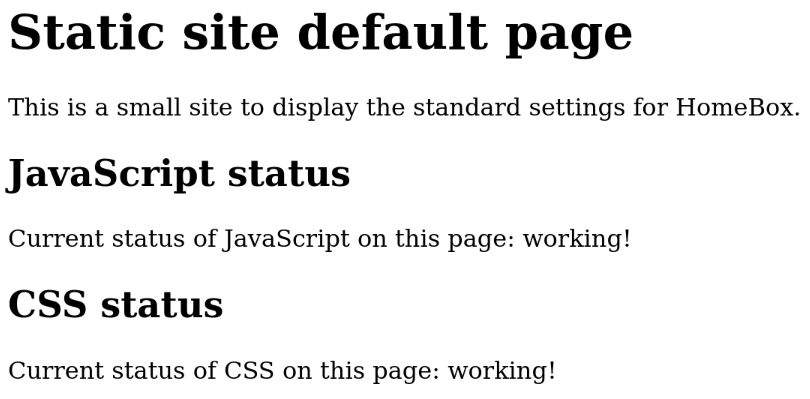

# Simple web site

This role creates the skeleton to host a simple _static_ web site, in HTML

The role deploys the minimum required:

- The certificates for the default site `www.your-domain.com`, `your-domain.com` and the the certificate renewal
  procedure.
- The nginx configuration for both `www.your-domain.com` and `your-domain.com`.
- Automatic redirection from _http_ to _https_.
- AppArmor profiles to restrict nginx access rights.

Additionally, sample content files are created, that you can override:

- A sample default index page.
- Two sample files, a CSS style sheet and JavaScript file.
- A server error sample page (500).
- A page not found sample page (404).
- An access denied sample page (403).

Once deployed, the site should look like this:



## Default settings

```yml
website_default:
  locale: en_GB.UTF-8
  ssi: false
```

- locale: Define the default locale to use in the nginx HTTP header.
- ssi: activate _nginx_ _Server Side Includes_. See the [dedicated documentation](40-server-side-includes.md) or the
  [official nginx documentation](https://nginx.org/en/docs/http/ngx_http_ssi_module.html).


## Updating nginx configuration

```sh
ROLE=website-simple ansible-playbook -t facts,nginx install.yml
```

The next page will show you how to retrieve the demo pages.
