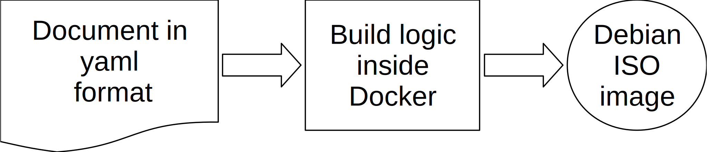

# Introduction

This step is only required if you want to build a Debian installation disc - before running the Ansible scripts. It does
not install the homebox server software stack.



The disc created does not install the mail server, only the Debian distribution. However, there are two features
automatically installed and easily configured: AppArmor and Full Disc Encryption with LUKS. This will protect you
against both remote and physical intrusion.

It is also copying your public SSH key onto the installation disc, so you can directly connect to your server
securely with your SSH key.

The installer runs with Ansible, as the root user. A flag can be set  to completely disable remote root login, and to
enforce sudo usage, once the installation is finished.

There are actually three flavours. The first one is a fully encrypted drive with a passphrase; the second one installs
on a machine with two drives and software RAID; the last one is using LVM only.

This script can be used both for development with a virtual machine or for production to install the operating system
base.

# Steps to do

## 1. Configure your system


Copy system-example.yml to system.yml, and modify the values accordingly:

```sh
cd preseed
cp system-example.yml system.yml
nano system.yml
```

The file is self-explanatory. A content example is shown below:

``` yaml
system:
  hostname: mail
  passphrase: Correct horse battery staple
  preseed: luks
  version: 11.1
  arch: amd64
  boot_timeout: 5   # In seconds

network:
  domain: example.com
  iface: auto            # or use eth0, ens3, etc...

# Country and locales definition
country:
  code: uk
  timezone: Europe/London

locale:
  id: en_GB
  language: en
  country: UK
  charset: UTF-8
  keymap: gb

# Repository specific values
repo:
  release: bullseye
  main: ftp.uk.debian.org
  security: security.debian.org
  sections: main contrib non-free

# Clock parameters
clock:
  utc: true
  ntp: true

# Accounts informations
# You can choose a strong password here,
root:
  password: Tr0ub4dor&3

# Debug: As it states
debug: true
```


## 3. Set up remote access

The second thing to do is to copy your SSH public key into the folder `config/authorized_key`. This file will be copied
into the `/root/.ssh/authorized_keys` by the automatic installer. This setup is absolutely required for Ansible to work.

For instance:

```sh
$ cat ~/.ssh/*.pub >config/authorized_key
```

[comment]: <> (TODO: Add this step in the installation process)

## 4. Build the ISO image

You are now ready to build the ISO image, run this command:

``` sh
cd preseed
ansible-playbook -i ../config/hosts.yml playbooks/build-iso.yml
```

This will create the ISO image in `/tmp/build-${hostname}/${hostname}-install.iso` folder, for instance
`/tmp/homebox/homebox-install.iso`

## 5. Boot the system

The whole installation should be automatic, both with LVM and software RAID. By default, only 90% of the disk is
used. This will let you resize the other volumes according to your needs.

If anything goes wrong, use issues on [Github project page](https://github.com/progmaticltd/homebox) for support.

!!! Note
    The installer has been tested both on a virtual and a physical machine. In the second case, the hardware differences
    sometimes stops and the installer asks questions. Just answer appropriately, and the installation procedure will
    continue further. Do not hesitate to send feedback about the questions asked.

!!! Tip
    If the installation crashes in the middle, try to disable ACPI, add/or the following boot parameters in the
    installer:

    ```
    intel_idle.max_cstate=1
    ```

The next step is detailed in the [installation](installation.md) section, and is really the installation procedure.

# Disk scheme options

## Full disk encryption

This is the recommended one. Use `preseed: luks`. Once installed, the system drive will be fully encrypted with
[LUKS](https://en.wikipedia.org/wiki/Linux_Unified_Key_Setup).

If you are interested, you can achieve redundancy of the system drive, using a hardware RAID enclosure.

## Software RAID

Use `preseed: raid`. Please, note that if you are using software RAID, the drives won't be encrypted. There are some
considerations to use file level encryption, but this is not implemented and might not be at all.

## LVM on BIOS

Use `preseed: lvm-bios`. No redundancy and no encryption. This is probably not what you want for a live system, but
might be useful for debugging.

## LVM on BIOS UEFI/Secure boot

Use `preseed: lvm-uefi`. Same as the previous one, with UEFI / Secure boot support included.

With a 32GB disk, the partitions sizes result is displayed below:

```
root@mail:~# df -h
Filesystem                   Size  Used Avail Use% Mounted on
udev                         1.9G     0  1.9G   0% /dev
tmpfs                        383M  664K  382M   1% /run
/dev/mapper/mail--vg-system  1.1G  3.3M  956M   1% /
/dev/mapper/mail--vg-usr     2.3G  784M  1.4G  36% /usr
tmpfs                        1.9G     0  1.9G   0% /dev/shm
tmpfs                        5.0M     0  5.0M   0% /run/lock
/dev/sda2                    231M   57M  158M  27% /boot
/dev/mapper/mail--vg-tmp     250M   11K  233M   1% /tmp
/dev/mapper/mail--vg-root    250M   18K  233M   1% /root
/dev/mapper/mail--vg-home     20G   24K   19G   1% /home
/dev/mapper/mail--vg-var     1.8G  143M  1.6G   9% /var
/dev/sda1                    240M  274K  239M   1% /boot/efi
/dev/mapper/mail--vg-log     766M   24M  688M   4% /var/log
tmpfs                        383M     0  383M   0% /run/user/0
root@mail:~# pvs
  PV                     VG      Fmt  Attr PSize  PFree
    /dev/mapper/sda3_crypt mail-vg lvm2 a--  28.83g <1.46g

```

You can easily extend and resize one partition, on the fly, with a command like this:

```sh
lvextend -r -L +500M /tmp
```
