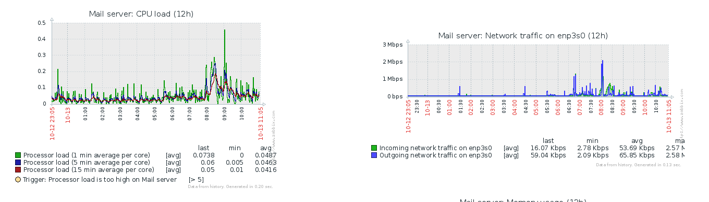

# Zabbix monitoring



## Default configuration

By default, the zabbix web interface is only accessible through the
local network, via https. Also, the guest account is deleted upon
installation.

A strong password is generated for the administrator account. After
the deployment, the password is stored in the deployment backup
folder, in `zabbix/admin.pwd`.

### Minimal configuration

```yaml

zabbix:
  install: true

```

### Default configuration

```yaml
# Zabbix monitoring
zabbix_default:
  install: false
  guest_account: false  # Allow guest account or not
  public: false         # not open to public by default
  allow:                # a list of IP address that can access the web interface
    - 192.168.0.0/16    # RFC1918 local networks
    - 172.16.0.0/12
    - 10.0.0.0/8

```

### Setting up Jabber alerts

To receive alerts via the XMPP protocol, it is necessary to activate
the Jabber _media type_ in the Zabbix administration console.

Use any account to send alerts, for instance the postmaster account.


Once this is set up, the alerts are visible in any XMPP compatible client.


